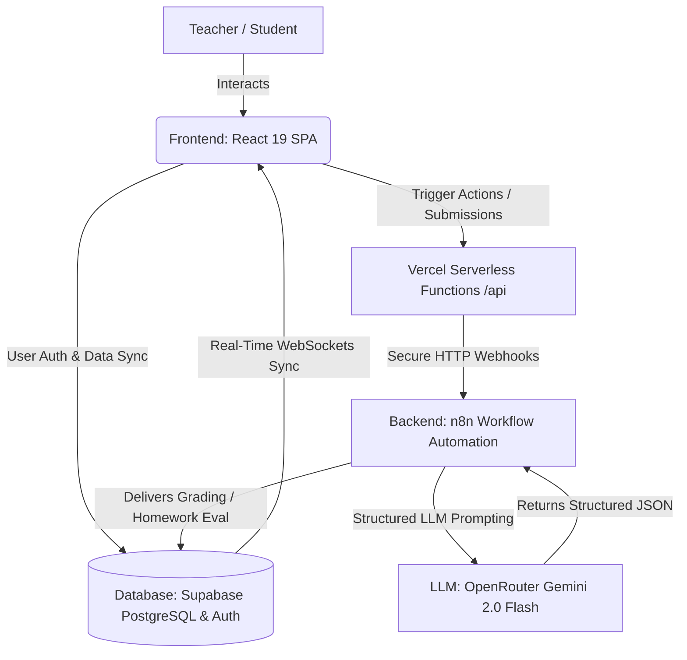

# 🎓 AI Teaching Studio

[](https://vercel.com/)
[](https://react.dev/)
[](https://tailwindcss.com/)
[](https://supabase.com/)
[](https://n8n.io/)

AI Teaching Studio is a high-fidelity, full-stack educational ecosystem that automates lesson design, student activities, and automated AI grading. Designed as a seamless portal for both educators and students, it harnesses structured LLM prompting, serverless architecture, and real-time database syncing to deliver instant classroom value.

🌐 **[Live Deployment Link](https://ai-teacher-studio-main.vercel.app)** *(Configure your Vercel URL here)*

---

## 📖 Table of Contents
1. [Product Overview](#-product-overview)
2. [Problem Solved](#-problem-solved)
3. [Solution Architecture](#-solution-architecture)
4. [Features](#-features)
5. [Workflow Explanation](#-workflow-explanation)
6. [Tech Stack](#-tech-stack)
7. [Repository Structure](#-repository-structure)
8. [Installation Steps](#-installation-steps)
9. [Environment Variables](#-environment-variables)
10. [Screenshots](#-screenshots)
11. [Future Roadmap](#-future-roadmap)
12. [Creator Information](#-creator-information)
13. [License](#-license)

---

## 🔍 Product Overview

**AI Teaching Studio** is a dual-portal application (Teacher & Student) designed to streamline the pedagogical lifecycle. 
* For **Teachers**, it instantly orchestrates custom lesson plans, interactive worksheet activities, homework sheets, and presentation slides matching specific academic standards and subjects.
* For **Students**, it serves as an interactive student panel to view assigned work, submit answers directly, and receive real-time grading, structured analytical scores, and personalized constructive feedback.

---

## 💡 Problem Solved

Traditional lesson planning and grading consumes **over 10-15 hours per week** of an educator's personal time.
1. **Resource Generation Fatigue**: Drafting classroom-ready worksheets, MCQ quizzes, homework assignments, and conceptual slide decks for multiple grade levels is tedious.
2. **Delayed Grading Feedback**: Manually grading essay-style homework and short answers delays feedback loop. Students perform better when graded immediately with contextual guidance.
3. **Tracking Class Performance**: Managing student score sheets, quiz attempts, and class-wide weaknesses is difficult without central, visual dashboards.

**AI Teaching Studio solves this** by automating the entire loop—from prompt-engineered lesson generation to instant, rubric-aligned AI student evaluation—allowing teachers to focus on active student mentorship.

---

## 🏗️ Solution Architecture

The studio uses a modern decoupled architecture. The frontend handles high-fidelity rendering, local state management, and real-time data syncs, while the serverless layers trigger n8n backend workflow engines executing structured LLM grading criteria.



---

## 🌟 Features

* **⚡ Interactive AI Lesson Kit Generator**: Create full lesson kits including warm-ups, concept lectures, guided group activities, recap checkpoints, and homework tasks in seconds.
* **✍️ Structural Worksheet Generator**: Generates 4 distinct sections: MCQs (1 mark), One-word responses (1 mark), Short answers (2 marks), and Long analytical answers (5 marks).
* **🎯 Active MCQ Quiz Portal**: Dedicated exam mode with strict question randomized option mapping.
* **🤖 Rubric-Aligned AI Grading Engine**: Automatically scores open-ended homework and worksheets, returning percentage-based grades (A, B, C, D) alongside detailed question-by-question feedback.
* **📊 Visual Analytics Suite**: Displays grade distribution charts, quiz average performance gauges, submission tracking, and conceptual gap warnings.
* **🎨 Glassmorphic Interface**: Harmonious dark theme with space-blue accents, smooth transitions, responsive data tables, and interactive card modules.

---

## 🔄 Workflow Explanation

### 1. The Lesson Creation Loop
1. The **Teacher** submits the topic, subject, grade level, and specific section count requirements.
2. The frontend POSTs a secure request to Vercel's `/api/lesson-webhook` serverless function.
3. The serverless function proxies the request to the `Workflow 1- create lesson kit` on **n8n**.
4. **n8n** compiles a rigorous teacher-prompt system and sends it to **Gemini 2.0** via OpenRouter.
5. The LLM returns a structured, strictly validated JSON object containing the complete lesson plan, worksheet sections, quiz MCQs, and answer key rubrics.
6. The data is saved back to **Supabase** and populated on the teacher's dashboard.

### 2. The Interactive Submission & Grading Loop
1. The **Student** logs in, selects a published lesson, and completes the worksheets or homework.
2. Upon submission, the student's work is saved in **Supabase** and triggers the respective serverless function (`/api/grade-worksheet` or `/api/evaluate-homework`).
3. The function activates the corresponding **n8n** workflow (`Workflow 2` or `Workflow 3`).
4. **n8n** sends the student answers, the original worksheet, and the teacher's master answer key to the AI.
5. The AI parses the responses, compiles question-by-question scores, determines the percentage grade, drafts constructive strengths/weaknesses, and writes a diagnostic teacher note.
6. The graded result is written directly to **Supabase**, immediately updating both the student's feedback card and the teacher's analytics dashboard.

---

## 💻 Tech Stack

| Layer | Technologies | Role / Description |
| :--- | :--- | :--- |
| **Frontend** | React 19, TypeScript, Vite 7 | High-performance, fast client rendering |
| **Routing** | TanStack Router | Client-side SPA route state management |
| **State & Fetching** | TanStack Query v5 | Optimized API caching and data fetching |
| **Styling** | Tailwind CSS v4, Vanilla CSS | Premium dark glassmorphic styling system |
| **Database & Auth** | Supabase (PostgreSQL, Realtime) | Central auth state, data storage, & sockets |
| **Serverless API** | Vercel Serverless (Node.js) | Secure backend proxy layers guarding `/api/*` |
| **Workflow Engine** | n8n | Visual workflow automation & API orchestration |
| **Large Language Model**| Gemini 2.0 Flash via OpenRouter | High-speed, highly structured JSON output generation |

---

## 📂 Repository Structure

```text
├── Backend/
│   ├── Workflow 1- create lesson kit.json    # Sanitized n8n lesson generation workflow
│   ├── Workflow 2 - grade worksheet.json     # Sanitized n8n worksheet grading workflow
│   └── Workflow 3 - evaluate homework.json    # Sanitized n8n homework evaluation workflow
│
├── Frontend/
│   ├── api/                   # Serverless Functions (evaluation, grading, proxy)
│   ├── src/                   # React components, routes, styles, and logic
│   ├── index.html             # Static mount entrypoint
│   ├── package.json           # Frontend dependencies
│   ├── vercel.json            # Routing & redirects configuration
│   ├── tsconfig.json          # TypeScript configurations
│   ├── vite.config.ts         # Vite bundler configurations
│   └── eslint.config.js       # Linter settings
│
├── Screenshots/               # UI Screenshots showcasing the platform
│   ├── ai teacher studio - login page.png
│   ├── ai teacher studio - home page.png
│   ├── ai teacher studio - lesson library page.png
│   ├── ai teacher studio- lesson kit page.png
│   └── ai teacher studio - analytics page.png
│
├── README.md                  # Comprehensive root documentation (this file)
└── .gitignore                 # Root Git ignore rules (applying recursively to all folders)
```

---

## 🚀 Installation Steps

### Prerequisites

Ensure you have [Node.js](https://nodejs.org/) (v18+) and [npm](https://www.npmjs.com/) installed.

### Installation

1. **Clone the repository:**
   ```bash
   git clone https://github.com/harshawasthi-ai/ai-teaching-studio-main.git
   cd ai-teaching-studio-main
   ```

2. **Navigate to the Frontend directory and install dependencies:**
   ```bash
   cd Frontend
   npm install
   ```

3. **Configure Environment Variables:**
   Create a `.env.local` file inside the `Frontend/` directory and add your Supabase credentials and API webhook endpoints:
   ```env
   VITE_SUPABASE_URL=your_supabase_url
   VITE_SUPABASE_ANON_KEY=your_supabase_anon_key
   N8N_LESSON_WEBHOOK_URL=your_n8n_lesson_webhook
   N8N_GRADING_WEBHOOK_URL=your_n8n_grading_webhook
   N8N_HOMEWORK_EVALUATION_WEBHOOK_URL=your_n8n_homework_webhook
   N8N_WEBHOOK_SECRET=your_secret_key
   ```

4. **Run the Development Server:**
   ```bash
   npm run dev
   ```
   Open [http://localhost:5173](http://localhost:5173) in your browser to view the application!

---

## 🔑 Environment Variables

To operate the full workflow pipeline successfully, ensure these variables are declared in your **Vercel Project Settings** and local `Frontend/.env.local`:

| Variable Name | Required In | Description |
| :--- | :--- | :--- |
| `VITE_SUPABASE_URL` | Frontend & Local | Your Supabase database API URL |
| `VITE_SUPABASE_ANON_KEY` | Frontend & Local | Your Supabase public anonymous key |
| `SUPABASE_SERVICE_ROLE_KEY` | Vercel Env Only | Admin key to securely write grading logs to profiles |
| `N8N_LESSON_WEBHOOK_URL` | Vercel Env Only | Public URL for the Lesson Kit n8n webhook |
| `N8N_GRADING_WEBHOOK_URL` | Vercel Env Only | Public URL for the Worksheet Grading n8n webhook |
| `N8N_HOMEWORK_EVALUATION_WEBHOOK_URL` | Vercel Env Only | Public URL for the Homework n8n webhook |
| `N8N_WEBHOOK_SECRET` | Vercel Env Only | Secret header token verifying api requests |

---

## 📸 Screenshots

Here is a visual walk-through of the **AI Teaching Studio** user experience:

### 1. Portal Gateway & Authentication
*Secure glassmorphic login screen supporting instant role selection.*


### 2. Teacher Command Hub
*Generate comprehensive, custom lessons by simply typing standard educational criteria.*


### 3. Lesson Library & Slideshow View
*Browse created lesson plans, download worksheet handouts, or present lesson slide slides.*


### 4. Interactive Quiz & Lesson Kit View
*Examine lesson kits or take interactive, dynamically generated MCQ quizzes.*


### 5. Class Analytics & Dashboard
*Gain deep insights into class scores, student worksheet responses, and average bands.*


---

## 🗺️ Future Roadmap

- [ ] **📈 AI Predictive Intervention**: Flag student learning gaps early based on historical homework submissions, generating custom remedial assignments.
- [ ] **📂 Google Classroom Integration**: Seamlessly sync created lesson plans, worksheet scores, and student grading sheets to standard Google Classroom accounts.
- [ ] **🎙️ Voice-Activated Lesson Designer**: Dictate teaching objectives and subject criteria to let the studio generate kits on the go.
- [ ] **👥 Peer Collaboration Panels**: Allow multiple teachers in the same school division to share lesson plans, rubrics, and worksheet feedback.

---

## 👤 Creator Information

* **Lead Architect & Developer**: Harsh Awasthi
* **GitHub**: [@harshawasthi-ai](https://github.com/harshawasthi-ai)
* **LinkedIn**: [Connect on LinkedIn](https://www.linkedin.com/in/harsh-awasthi-981555335/)

Feel free to open an issue or submit a pull request if you want to contribute to the project!

---

## 📄 License

This project is licensed under the **MIT License** - see the [LICENSE](LICENSE) file for details.

Copyright (c) 2026 Harsh Awasthi.
